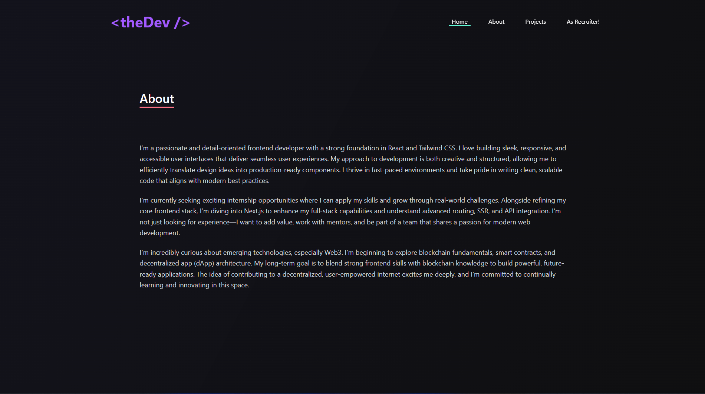
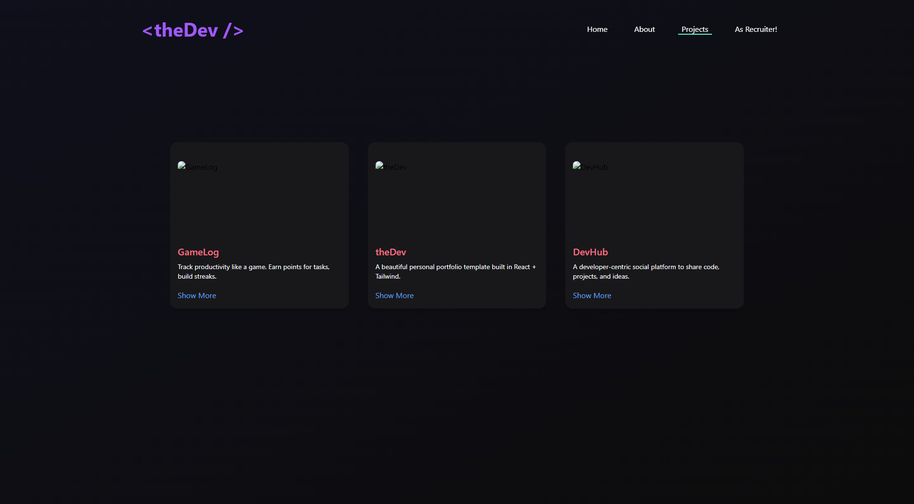
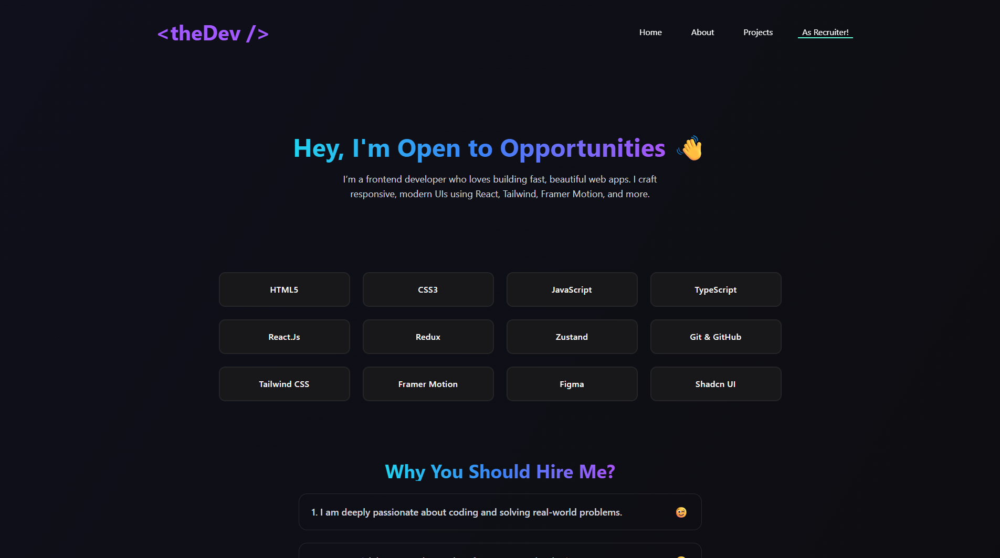

# 🧑‍💻 Satya Prakash Behera — Portfolio

Welcome to my personal developer portfolio website! This is a fully responsive, modern, and production-ready portfolio built to showcase my skills, projects, experience, and contact information. Built with ❤️ using React.js, TailwindCSS, and a clean component-driven design approach.

---

## 🚀 Demo

🟢 **Live Website:** [https://satyageek.vercel.app](https://satyageek.vercel.app)

---

## 📸 Screenshots

### 🖥️ Home Page


### 👤 About Page



### 📁 Projects Section



### 📞 Contact Page



---

## 🛠️ Features

- ⚡ Fully responsive and mobile-friendly
- 🎯 Hero section with animated introduction
- 🧠 About Me section with current focus and future goals
- 🛠️ Projects showcase with links to GitHub and live demos
- 🧾 Resume download
- 📬 Contact form with working email integration (using EmailJS)
- 🌐 SEO-friendly, meta-tag optimized
- 🎨 Smooth animations with Framer Motion
- 📚 Clean folder structure for scalability

---

## 🧩 Tech Stack

| Tech          | Description                                    |
| ------------- | ---------------------------------------------- |
| React.js      | UI library for building interactive interfaces |
| TailwindCSS   | Utility-first CSS framework for styling        |
| Framer Motion | Animations and transitions                     |
| React Router  | Routing between pages                          |
| Vite          | Blazing fast build tool                        |
| Vercel        | Deployment platform                            |

---

## 📁 Folder Structure

```
├── public/
├── src/
│ ├── assets/ # Images, icons
│ ├── components/ # Reusable component
| | |── HomePage Components
| | |── AsRecruiterpage Components
| | |── Individual Components
| | |── ProjectPage Components
│ ├── pages/ # Home, About, Projects, Contact
│ ├── constants/ # Data files (projects, skills)
│ ├── App.jsx
│ ├── main.jsx
├── .gitignore
├── package.json
├── tailwind.config.js
├── postcss.config.js
├── README.md
```

## ⚙️ Getting Started Locally

To run this project locally on your machine:


### 1.Clone in your local machine

```
> git clone https://github.com/yourusername/portfolio.git
> cd <your-filename>
```

### 2. Install Dependencies

```
> npm install or npm i
```

### Run the dev server

```
> npm run dev
```

---

## ⚙️ Personal Info

🧑‍💼 About Me
I’m Satya Prakash Behera, a passionate frontend developer currently pursuing B.Tech in CSE (4th Semester, 8.1 SGPA). I specialize in building responsive, fast, and aesthetically pleasing web interfaces using modern technologies like React.js, TailwindCSS, and Framer Motion.


### 🚀 My interests lies in frontend SaaS, developer tools, productivity apps, and Web3 UI integration.


🧠 Learnings from This Project
While building this portfolio, I learned:

📐 How to structure and organize a scalable React app
🎨 Advanced TailwindCSS utilities and responsive design best practices
🎞️ Using Framer Motion for clean and engaging UI animations
📬 Integrating EmailJS to add functional contact forms
💻 Hosting and deploying production-ready projects on Vercel


## 📬 Contact

Want to work together or have a project idea? Let’s connect!

- 📧 Email: [the.satyabehera@gmail.com](mailto:the.satyabehera@gmail.com)
- 💼 LinkedIn: [Satya Prakash Behera](https://linkedin.com/in/satya-prakash-behera007)
- 🐙 GitHub: [@Satya-geek7](https://github.com/Satya-geek7)
- 🌐 Portfolio: [satyageek.vercel.app](https://satyageek.vercel.app)


---

## 🙌 Thank You for Visiting!

Thanks for taking the time to check out my portfolio. If you liked what you saw or are interested in working together, feel free to reach out via email or LinkedIn. I'm always open to exciting collaborations and remote opportunities!

```
> Built with love by Satya Prakash Behera 💻
>⭐️ If you found this helpful, consider starring the repo!
```